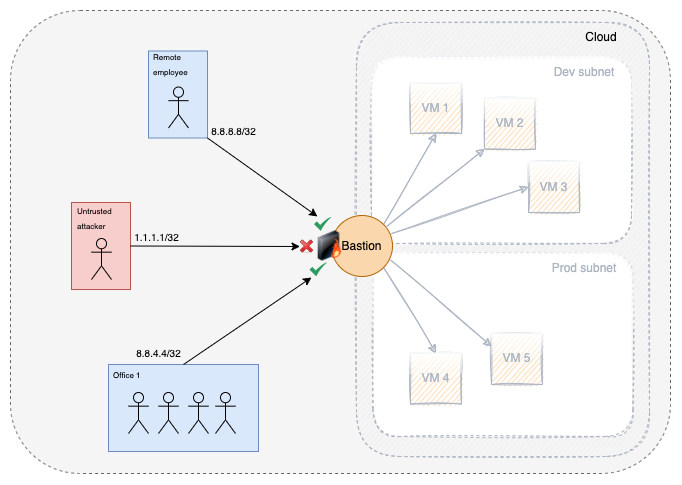

# Production deployment

## Network diagram

In a simple production deployment setup, an ideal network diagram would look like this:



Your bastion host is the only publicly accessible host, while all your distant hosts are privately addressed 
in your internal network, and your bastion host has access to all of these distant hosts.

To ensure security to the highest level, your bastion host is firewalled at the network level to only allow inbound 
traffic on the SSH port from trusted sources (e.g. your offices and trusted users IP addresses).

Of course, if unauthorized users try to access your bastion from a trusted IP address, they will be denied access 
by the SSH authentication mechanism.

## Using groups to grant access

Once trusted users are authenticated on the bastion, the best way to give them access to distant hosts is to use groups.

### Setup groups

We'll use a simple example setup with two groups on the bastion: `dev` and `prod`:

```
t1000@skynet:~# sb group create --name dev --owner-account t1000 --algo ed25519 --size 256
Group dev was successfully created
The new egress private SSH key was successfully generated

t1000@skynet:~# sb group create --name prod --owner-account t1000 --algo ed25519 --size 256
Group prod was successfully created
The new egress private SSH key was successfully generated
```

Now that the groups are created, you can get the SSH public keys that were generated during the creation of the groups:
```
t1000@skynet:~# sb group info --group dev
Here are the info of group dev:
    - List of group owners: t1000
    - List of group gate-keepers: t1000
    - List of group acl-keepers: t1000
    - List of group members: t1000
List of group's egress public SSH keys (sb -> distant host):
1: ssh-ed25519 AAAAC3NzaC1lZDI1NTE5AAAAINnuNP8pAfBTcfoi82qK7A+jYSUofVjmVK7od604jluk bg_dev@sb:27105:1658940261

t1000@skynet:~# sb group info --group prod                                                
Here are the info of group prod:
    - List of group owners: t1000
    - List of group gate-keepers: t1000
    - List of group acl-keepers: t1000
    - List of group members: t1000
List of group's egress public SSH keys (sb -> distant host):
1: ssh-ed25519 AAAAC3NzaC1lZDI1NTE5AAAAIB4raKwsNNzVf0F4adxfwjt90hEIxgcFuPZvKnLlfR6c bg_prod@sb:38595:1658943719
```

Simply put these two SSH public keys in your `.ssh/authorized_keys` files on your distant hosts. The bastion will make 
sure that the private keys stay private and that only trusted members of the groups can access the hosts 
with the group's SSH key.

This is enforced by configuring accesses for each group. Let's say you have two distinct subnets in your network:
- a subnet hosting dev machines: 10.20.0.0/16
- a subnet hosting prod machines: 10.10.0.0/16

You could create two access rules allowing the `dev` and `prod` groups to access these subnets:

```
t1000@skynet:~# sb group access add --group dev --host 10.20.0.0/16 --user root --port 22
The access has been granted: Prefix: 10.20.0.0/16    | Host:    | Alias:    | User: root    | Port: 22

t1000@skynet:~# sb group access add --group prod --host 10.10.0.0/16 --user root --port 22
The access has been granted: Prefix: 10.10.0.0/16    | Host:    | Alias:    | User: root    | Port: 22
```

With these rules, every member of the `dev` group will be granted access to all hosts in the `dev` subnet 
and every member of the `prod` group will be granted access to all hosts in the `prod` subnet.

All that's left to do is to add your users to the correct groups.

### Adding users to groups

Let's say you have two employees:
- Alice, S.R.E
- Bob, software developer

In our example of two subnets `dev` and `prod`:
- Bob would be granted access to the `dev` subnet
- Alice would be granted access to all the infrastructure (both `dev` and `prod` subnets)

Let's add our users to the groups:

```
t1000@skynet:~# sb group member add --account alice --group dev
Account alice was successfully added as a member of group dev

t1000@skynet:~# sb group member add --account bob --group dev
Account bob was successfully added as a member of group dev

t1000@skynet:~# sb group member add --account alice --group prod
Account alice was successfully added as a member of group prod
```

Alice and Bob can now connect their respective granted subnets:

```
alice@wonderlands:~# sb root@10.10.0.1                  
*------------------------------------------------------------------------------*
|THIS IS A PRIVATE COMPUTER SYSTEM, UNAUTHORIZED ACCESS IS STRICTLY PROHIBITED.|
|ALL CONNECTIONS ARE LOGGED. IF YOU ARE NOT AUTHORIZED, DISCONNECT NOW.        |
*------------------------------------------------------------------------------*
Hey! Welcome to sb, alice!
Access to this host is granted by:
- group access from group prod
... connecting you to the distant host (if it's alive :)) ...
[...]

bob@builder:~# sb root@10.20.0.1                  
*------------------------------------------------------------------------------*
|THIS IS A PRIVATE COMPUTER SYSTEM, UNAUTHORIZED ACCESS IS STRICTLY PROHIBITED.|
|ALL CONNECTIONS ARE LOGGED. IF YOU ARE NOT AUTHORIZED, DISCONNECT NOW.        |
*------------------------------------------------------------------------------*
Hey! Welcome to sb, bob!
Access to this host is granted by:
- group access from group dev
... connecting you to the distant host (if it's alive :)) ...
[...]
```


And Bob is denied access to the `prod` subnet:

```
bob@builder:~# sb root@10.10.0.1                                                                                                                            
Error while executing command: user can't access the host root@10.10.0.1
```


